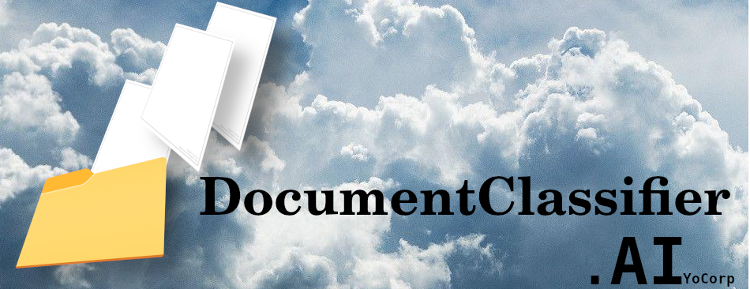
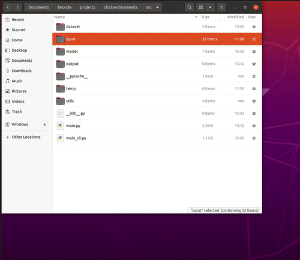

<!-- PROJECT LOGO -->

  <h3 align="center">
    Classifying your documents has never been so easy
  </h3>
   

# 
<blockquote>Fictionnal speech:

[DocumentClassifier.ai](https://github.com/yolannos/cluster-documents) is an app allowing you to easily classify your documents based on a clustering algorithm - aka AI mechanisms.

This app has a Graphical User Interface (GUI) which makes life easier for your employees. 

You just have to select the folder containing the PDF's and the AI automatically classifies them in the appropriate folder ('appropriate' according to the AI :bowtie: )
</blockquote>

#### This application is in response to a challenge given by [Becode](https://becode.org/):
- You are a new developer in the company and your mission is to use clustering techniques to classify the documents and reduce the manual work. 

The data used for this challenge comes from [Kleister Charity](https://github.com/applicaai/kleister-charity/tree/master/train).
It was solved in 1 week.

# __Demo__

# Process:
## Training of the model:
### Cleaning
To make sure the data are optimal for the algorithm a cleaning has been applied. Tokenisation, lemmatisation, removal of stopping-words and punctuation has been applied
### Preprocessing:
In order to make 'words' comprehensible for the machine a [TFIDVectorizer](https://scikit-learn.org/stable/modules/generated/sklearn.feature_extraction.text.TfidfVectorizer.html) method has been applied and the resulting matrix has been reduced via [TruncatedSVD](https://scikit-learn.org/stable/modules/generated/sklearn.decomposition.TruncatedSVD.html).
### Training per se
Two different models have been used to perform the clusterisation. The first one is:
>[K-means clustering](https://scikit-learn.org/stable/modules/generated/sklearn.cluster.KMeans.html) which try to separate data i n group of equal variance, minimizing a criterion known as the inertia. The number of cluster is required.

The second one is the:
>[Fuzzy C-means](https://www.sciencedirect.com/science/article/pii/0098300484900207?via%3Dihub) which is interesting because it give a probability to belong to different clusters. The number of cluster is required.

### Conclusion
The clusterisation seems to be aleatory. I was not satisfied by the results and wanted to orientate the clusterisation with human-logical clusters (which of course was not the purpose of the exercise). But it is interesting to see the limitations of the models/input used.

## Creation of the app:
### Backend
- The app uses a PDF as an input. For the extraction of the text there are two possible approaches:
  1) PdfToText "selects" the text and extract it -> Really fast but not the most effective
  2) OCR converts the PDF as an image (PIL) and uses Tesseract (ML) to extract the text: effective but really slow
    
If not specified, it uses PdfToText. If the text extracted seems too short it uses automatically Tesseract.
    
- The app loads the model and uses the input files to make a prediction and relocate them in the correct folder
### Frontend
For the GUI interface, I used the PySimpleQt library based on the PyQt framework. 

## Future improvements

- **Use other models of clustering**: Clustering Modelisation has limitation for this kind of task but it could be interesting to integrate other models such as the Based Spatial Clustering of Applications with Noise or the Variational Bayesian estimation of a Gaussian mixture.

