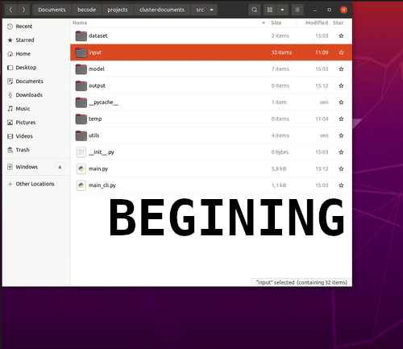

# DocumentClassifier.ai - Classifying your documents has never been so easy

<blockquote>Fictionnal speech:

[DocumentClassifier.ai](https://github.com/yolannos/cluster-documents) is an app allowing you to easily classify your documents based on a clustering algorithm - aka AI mechanisms.

This app has a Graphical User Interface (GUI) which makes life easier for your employees. 

You just have to select the folder containing the PDF's and the app automatically classify them in the appropriate folder (appropriate according to the AI :bowtie: )
</blockquote>

#### This application is a response to a challenge given by [Becode](https://becode.org/):
- You are a new developer in the company and your mission is to use clustering techniques to classify the documents and reduce the manual work. 

The data used for this challenge comes from [Kleister Charity](https://github.com/applicaai/kleister-charity/tree/master/train).
It was solved in 1 week.

### __Demo__

# Process:
## Training of the model:

## Future improvements

- **Use other models of clustering**: Clustering Modelisation has limitation for this kind of task but it could be interesting to integrate other models such as the Based Spatial Clustering of Applications with Noise or the Variational Bayesian estimation of a Gaussian mixture.

